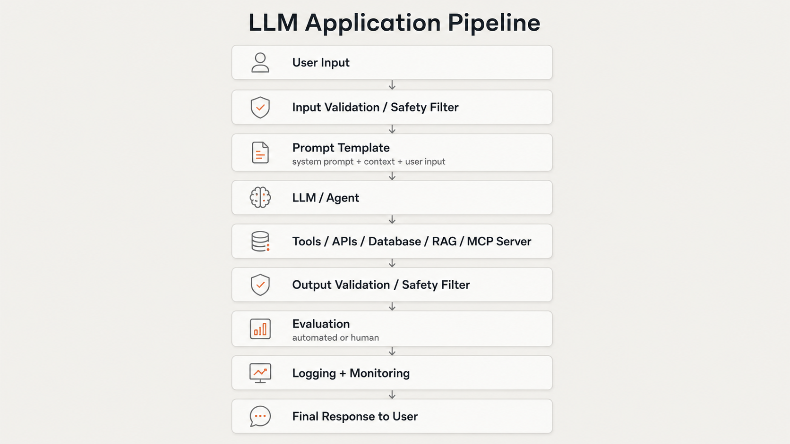
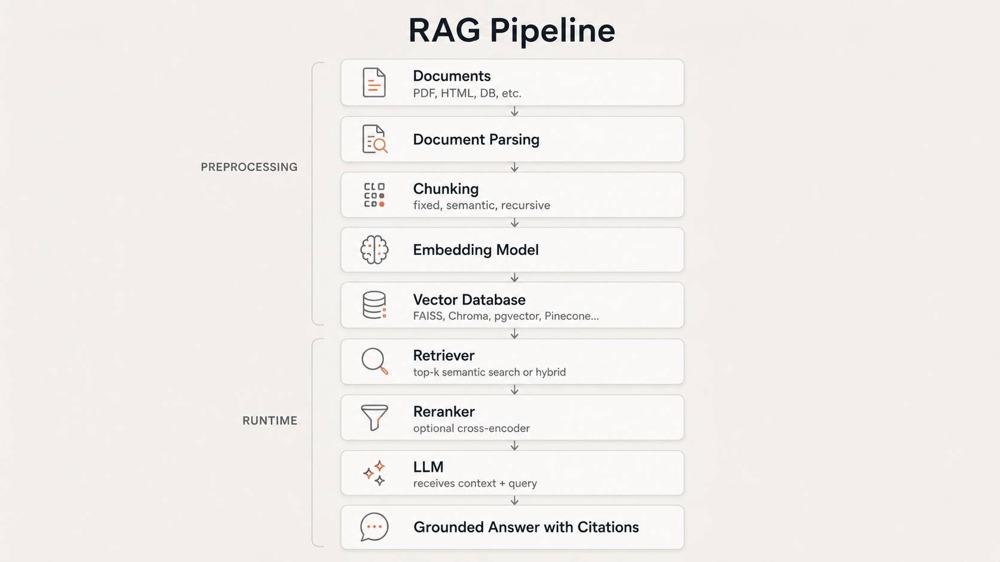
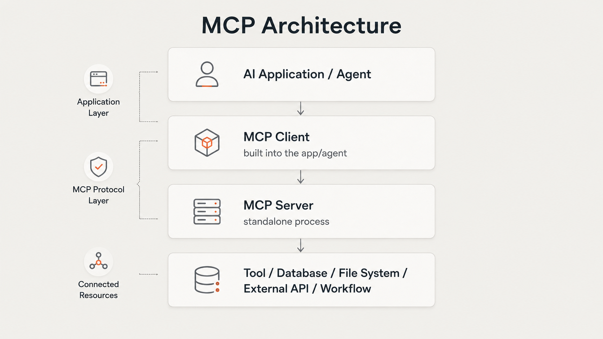
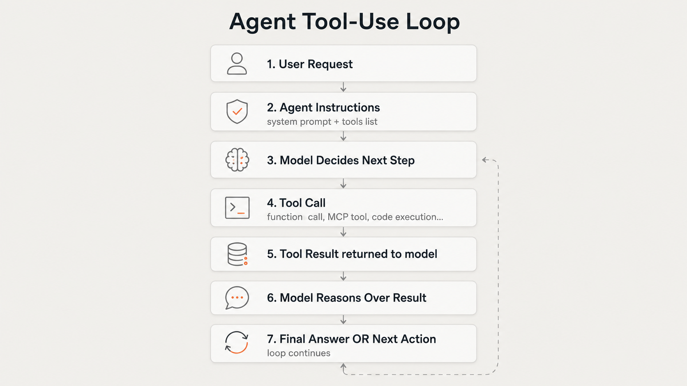

# AI Engineer Study Notes

> A practical, structured reference for learning AI Engineering from fundamentals to production.
> Built for studying, revision, interviews, and project building.

---

## Purpose

This repository is a personal study system for AI Engineering. It covers the full stack of skills needed to design, build, ship, and evaluate AI-powered applications — from LLM basics to production deployment.

It is written for someone who learns by building. Theory is included where it matters, not as a prerequisite.

**Not a course. Not a tutorial series. A working reference.**

---

## Study Philosophy

- Build first. Understand the mechanics after you have something running.
- Know *why* each component exists, not just *how* to use it.
- Study failure modes as seriously as success patterns.
- Treat every concept as something you may need to explain in an interview or defend in a code review.
- Cover the full stack: prompting → retrieval → tools → agents → safety → deployment.

---

## AI Engineer System Map

This is the full pipeline of a production AI system. Every module in this repo maps to one or more layers here.



---

## RAG System Map



---

## MCP System Map



MCP standardizes how AI apps connect to external capabilities. One MCP server can serve multiple clients. See [08_mcp/](08_mcp/what_is_mcp.md).

---

## Agent Loop Map



---

## Learning Sequence

Follow this order. Each module builds on the previous.

| # | Module | Status |
|---|--------|--------|
| 00 | [Roadmap](00_roadmap/) | |
| 01 | [AI / LLM Basics](01_ai_llm_basics/) | |
| 02 | [Prompt Engineering](02_prompt_engineering/) | |
| 03 | [Structured Outputs](03_structured_outputs/) | |
| 04 | [LLM APIs + Backend](04_llm_apis_backend/) | |
| 05 | [Embeddings + Semantic Search](05_embeddings_semantic_search/) | |
| 06 | [RAG](06_rag/) | |
| 07 | [Tool Calling](07_tool_calling/) | |
| 08 | [MCP — Model Context Protocol](08_mcp/) | |
| 09 | [Agents](09_agents/) | |
| 10 | [Evaluations](10_evaluations/) | |
| 11 | [Memory + Context Management](11_memory_context/) | |
| 12 | [Prompting vs RAG vs Fine-tuning vs Agents](12_finetuning_vs_rag_vs_prompting/) | |
| 13 | [Safety + Guardrails](13_safety_guardrails/) | |
| 14 | [Production Deployment](14_production_deployment/) | |
| 15 | [Portfolio Projects](15_projects/) | |

Use the **Status** column to track your progress: leave blank, add `In progress`, or `Done`.

---

## Full Module Map

### 00 Roadmap
- [AI Engineer Role](00_roadmap/ai_engineer_role.md)
- [Learning Plan](00_roadmap/learning_plan.md)
- [Source List](00_roadmap/source_list.md)
- [Glossary](00_roadmap/glossary.md)

### 01 AI / LLM Basics
- [AI vs ML vs Deep Learning](01_ai_llm_basics/ai_vs_ml_vs_deep_learning.md)
- [What Is an LLM](01_ai_llm_basics/what_is_an_llm.md)
- [Tokens](01_ai_llm_basics/tokens.md)
- [Context Window](01_ai_llm_basics/context_window.md)
- [Embeddings Intro](01_ai_llm_basics/embeddings_intro.md)
- [Transformers High Level](01_ai_llm_basics/transformers_high_level.md)

### 02 Prompt Engineering
- [Prompt Basics](02_prompt_engineering/prompt_basics.md)
- [Role / Task / Context / Format](02_prompt_engineering/role_task_context_format.md)
- [Few-Shot Prompting](02_prompt_engineering/few_shot_prompting.md)
- [Prompt Templates](02_prompt_engineering/prompt_templates.md)
- [Prompt Iteration](02_prompt_engineering/prompt_iteration.md)
- [Prompt Failure Modes](02_prompt_engineering/prompt_failure_modes.md)
- [Prompt Examples](02_prompt_engineering/prompt_examples.md)

### 03 Structured Outputs
- [Why Structured Outputs](03_structured_outputs/why_structured_outputs.md)
- [JSON Outputs](03_structured_outputs/json_outputs.md)
- [Schemas](03_structured_outputs/schemas.md)
- [Pydantic Validation](03_structured_outputs/pydantic_validation.md)
- [Extraction Tasks](03_structured_outputs/extraction_tasks.md)
- [Structured Output Project](03_structured_outputs/structured_output_project.md)

### 04 LLM APIs + Backend
- [OpenAI API Basics](04_llm_apis_backend/openai_api_basics.md)
- [Claude API Basics](04_llm_apis_backend/claude_api_basics.md)
- [FastAPI Basics](04_llm_apis_backend/fastapi_basics.md)
- [Environment Variables](04_llm_apis_backend/environment_variables.md)
- [API Error Handling](04_llm_apis_backend/api_error_handling.md)
- [Logging AI Requests](04_llm_apis_backend/logging_ai_requests.md)
- [Backend Project](04_llm_apis_backend/backend_project.md)

### 05 Embeddings + Semantic Search
- [What Are Embeddings](05_embeddings_semantic_search/what_are_embeddings.md)
- [Cosine Similarity](05_embeddings_semantic_search/cosine_similarity.md)
- [Vector Databases](05_embeddings_semantic_search/vector_databases.md)
- [Keyword vs Semantic Search](05_embeddings_semantic_search/keyword_vs_semantic_search.md)
- [Hybrid Search](05_embeddings_semantic_search/hybrid_search.md)
- [Semantic Search Project](05_embeddings_semantic_search/semantic_search_project.md)

### 06 RAG
- [What Is RAG](06_rag/what_is_rag.md)
- [RAG Architecture](06_rag/rag_architecture.md)
- [Document Loading](06_rag/document_loading.md)
- [Chunking](06_rag/chunking.md)
- [Retrieval](06_rag/retrieval.md)
- [Reranking](06_rag/reranking.md)
- [Grounded Generation](06_rag/grounded_generation.md)
- [Citations](06_rag/citations.md)
- [RAG Failure Modes](06_rag/rag_failure_modes.md)
- [RAG Project](06_rag/rag_project.md)

### 07 Tool Calling
- [What Is Tool Calling](07_tool_calling/what_is_tool_calling.md)
- [Function Schemas](07_tool_calling/function_schemas.md)
- [Read Tools vs Write Tools](07_tool_calling/read_tools_vs_write_tools.md)
- [Tool Safety](07_tool_calling/tool_safety.md)
- [Human Approval](07_tool_calling/human_approval.md)
- [SQL Tool Project](07_tool_calling/sql_tool_project.md)

### 08 MCP — Model Context Protocol
- [What Is MCP](08_mcp/what_is_mcp.md)
- [Why MCP Exists](08_mcp/why_mcp_exists.md)
- [MCP Architecture](08_mcp/mcp_architecture.md)
- [MCP Client / Server / Host](08_mcp/mcp_client_server_host.md)
- [MCP Tools / Resources / Prompts](08_mcp/mcp_tools_resources_prompts.md)
- [MCP vs Tool Calling](08_mcp/mcp_vs_tool_calling.md)
- [MCP vs API](08_mcp/mcp_vs_api.md)
- [MCP Security](08_mcp/mcp_security.md)
- [Building an MCP Server](08_mcp/building_mcp_server.md)
- [MCP Project](08_mcp/mcp_project.md)

### 09 Agents
- [What Is an Agent](09_agents/what_is_an_agent.md)
- [Agent Loop](09_agents/agent_loop.md)
- [Agent vs Workflow](09_agents/agent_vs_workflow.md)
- [Agent Types](09_agents/agent_types.md)
- [Handoffs](09_agents/handoffs.md)
- [Guardrails for Agents](09_agents/guardrails_for_agents.md)
- [Tracing](09_agents/tracing.md)
- [Agent Project](09_agents/agent_project.md)

### 10 Evaluations
- [Why Evals Matter](10_evaluations/why_evals_matter.md)
- [Eval Dataset](10_evaluations/eval_dataset.md)
- [Prompt Evals](10_evaluations/prompt_evals.md)
- [RAG Evals](10_evaluations/rag_evals.md)
- [Agent Evals](10_evaluations/agent_evals.md)
- [Structured Output Evals](10_evaluations/structured_output_evals.md)
- [Human Evaluation](10_evaluations/human_evaluation.md)
- [Eval Project](10_evaluations/eval_project.md)

### 11 Memory + Context
- [Short-Term Memory](11_memory_context/short_term_memory.md)
- [Long-Term Memory](11_memory_context/long_term_memory.md)
- [Conversation State](11_memory_context/conversation_state.md)
- [Context Window Management](11_memory_context/context_window_management.md)
- [Memory Project](11_memory_context/memory_project.md)

### 12 Prompting vs RAG vs Fine-tuning vs Agents
- [Prompting vs RAG](12_finetuning_vs_rag_vs_prompting/prompting_vs_rag.md)
- [RAG vs Fine-tuning](12_finetuning_vs_rag_vs_prompting/rag_vs_finetuning.md)
- [When to Fine-tune](12_finetuning_vs_rag_vs_prompting/when_to_finetune.md)
- [Decision Table](12_finetuning_vs_rag_vs_prompting/decision_table.md)
- [Case Studies](12_finetuning_vs_rag_vs_prompting/case_studies.md)

### 13 Safety + Guardrails
- [Hallucination](13_safety_guardrails/hallucination.md)
- [Prompt Injection](13_safety_guardrails/prompt_injection.md)
- [Data Leakage](13_safety_guardrails/data_leakage.md)
- [Unsafe Tool Calls](13_safety_guardrails/unsafe_tool_calls.md)
- [Input Guardrails](13_safety_guardrails/input_guardrails.md)
- [Output Guardrails](13_safety_guardrails/output_guardrails.md)
- [Safety Checklist](13_safety_guardrails/safety_checklist.md)

### 14 Production Deployment
- [Docker Basics](14_production_deployment/docker_basics.md)
- [CI/CD](14_production_deployment/ci_cd.md)
- [Deployment Architecture](14_production_deployment/deployment_architecture.md)
- [Monitoring](14_production_deployment/monitoring.md)
- [Cost Tracking](14_production_deployment/cost_tracking.md)
- [Latency](14_production_deployment/latency.md)
- [Production Checklist](14_production_deployment/production_checklist.md)

### 15 Portfolio Projects
- [Project 1: Financial RAG Assistant](15_projects/project_1_financial_rag_assistant.md)
- [Project 2: SQL Agent](15_projects/project_2_sql_agent.md)
- [Project 3: Workflow Agent](15_projects/project_3_workflow_agent.md)
- [Portfolio README](15_projects/portfolio_readme.md)

### Resources
- [Official Sources](resources/official_sources.md)
- [Courses](resources/courses.md)
- [Papers](resources/papers.md)
- [Tools](resources/tools.md)
- [Cheatsheets](resources/cheatsheets.md)

---

## Where MCP Fits

MCP (Model Context Protocol) is covered in [Module 08](08_mcp/what_is_mcp.md), but it intersects with several other modules:

| Module | MCP Relevance |
|--------|--------------|
| 07 Tool Calling | MCP is an alternative standardized layer on top of tool calling |
| 09 Agents | Agents can call MCP servers as their tool execution layer |
| 13 Safety | MCP servers can expose dangerous capabilities — security matters |
| 14 Production | MCP servers are deployable services that need monitoring |

MCP sits between an agent and the tools it uses. It standardizes the protocol so that any MCP-compatible client can use any MCP-compatible server, without custom integration per tool.

---

## Project Roadmap

| Project | Core Skills Covered | Module Dependencies |
|---------|--------------------|--------------------|
| Semantic Search Engine | Embeddings, vector DB, cosine similarity | 05 |
| Financial RAG Assistant | RAG, chunking, retrieval, citations | 05, 06 |
| SQL Agent | Tool calling, function schemas, safety | 07 |
| Workflow Agent | Agents, handoffs, tracing, guardrails | 09 |
| Full Eval Suite | Evals for RAG + agents | 10 |

Build in sequence. Each project is a prerequisite for the next.

---

## Suggested Weekly Study Plan

This is a suggested pace. Adjust based on your available time.

| Week | Focus | Modules |
|------|-------|---------|
| 1 | Foundations | 00, 01 |
| 2 | Prompting + Structured Output | 02, 03 |
| 3 | APIs + Backend | 04 |
| 4 | Embeddings + Search | 05 |
| 5 | RAG (core) | 06 |
| 6 | Tool Calling + MCP | 07, 08 |
| 7 | Agents | 09 |
| 8 | Evals + Memory | 10, 11 |
| 9 | Decision Making + Safety | 12, 13 |
| 10 | Production + Projects | 14, 15 |

---

## Progress Tracker

Mark each file as you complete it. Copy this section into a separate `progress.md` if you prefer.

```
[ ] 00_roadmap/ai_engineer_role.md
[ ] 00_roadmap/learning_plan.md
[ ] 00_roadmap/source_list.md
[ ] 00_roadmap/glossary.md

[ ] 01_ai_llm_basics/ai_vs_ml_vs_deep_learning.md
[ ] 01_ai_llm_basics/what_is_an_llm.md
[ ] 01_ai_llm_basics/tokens.md
[ ] 01_ai_llm_basics/context_window.md
[ ] 01_ai_llm_basics/embeddings_intro.md
[ ] 01_ai_llm_basics/transformers_high_level.md

[ ] 02_prompt_engineering/prompt_basics.md
[ ] 02_prompt_engineering/role_task_context_format.md
[ ] 02_prompt_engineering/few_shot_prompting.md
[ ] 02_prompt_engineering/prompt_templates.md
[ ] 02_prompt_engineering/prompt_iteration.md
[ ] 02_prompt_engineering/prompt_failure_modes.md
[ ] 02_prompt_engineering/prompt_examples.md

[ ] 03_structured_outputs/why_structured_outputs.md
[ ] 03_structured_outputs/json_outputs.md
[ ] 03_structured_outputs/schemas.md
[ ] 03_structured_outputs/pydantic_validation.md
[ ] 03_structured_outputs/extraction_tasks.md
[ ] 03_structured_outputs/structured_output_project.md

[ ] 04_llm_apis_backend/openai_api_basics.md
[ ] 04_llm_apis_backend/claude_api_basics.md
[ ] 04_llm_apis_backend/fastapi_basics.md
[ ] 04_llm_apis_backend/environment_variables.md
[ ] 04_llm_apis_backend/api_error_handling.md
[ ] 04_llm_apis_backend/logging_ai_requests.md
[ ] 04_llm_apis_backend/backend_project.md

[ ] 05_embeddings_semantic_search/what_are_embeddings.md
[ ] 05_embeddings_semantic_search/cosine_similarity.md
[ ] 05_embeddings_semantic_search/vector_databases.md
[ ] 05_embeddings_semantic_search/keyword_vs_semantic_search.md
[ ] 05_embeddings_semantic_search/hybrid_search.md
[ ] 05_embeddings_semantic_search/semantic_search_project.md

[ ] 06_rag/what_is_rag.md
[ ] 06_rag/rag_architecture.md
[ ] 06_rag/document_loading.md
[ ] 06_rag/chunking.md
[ ] 06_rag/retrieval.md
[ ] 06_rag/reranking.md
[ ] 06_rag/grounded_generation.md
[ ] 06_rag/citations.md
[ ] 06_rag/rag_failure_modes.md
[ ] 06_rag/rag_project.md

[ ] 07_tool_calling/what_is_tool_calling.md
[ ] 07_tool_calling/function_schemas.md
[ ] 07_tool_calling/read_tools_vs_write_tools.md
[ ] 07_tool_calling/tool_safety.md
[ ] 07_tool_calling/human_approval.md
[ ] 07_tool_calling/sql_tool_project.md

[ ] 08_mcp/what_is_mcp.md
[ ] 08_mcp/why_mcp_exists.md
[ ] 08_mcp/mcp_architecture.md
[ ] 08_mcp/mcp_client_server_host.md
[ ] 08_mcp/mcp_tools_resources_prompts.md
[ ] 08_mcp/mcp_vs_tool_calling.md
[ ] 08_mcp/mcp_vs_api.md
[ ] 08_mcp/mcp_security.md
[ ] 08_mcp/building_mcp_server.md
[ ] 08_mcp/mcp_project.md

[ ] 09_agents/what_is_an_agent.md
[ ] 09_agents/agent_loop.md
[ ] 09_agents/agent_vs_workflow.md
[ ] 09_agents/agent_types.md
[ ] 09_agents/handoffs.md
[ ] 09_agents/guardrails_for_agents.md
[ ] 09_agents/tracing.md
[ ] 09_agents/agent_project.md

[ ] 10_evaluations/why_evals_matter.md
[ ] 10_evaluations/eval_dataset.md
[ ] 10_evaluations/prompt_evals.md
[ ] 10_evaluations/rag_evals.md
[ ] 10_evaluations/agent_evals.md
[ ] 10_evaluations/structured_output_evals.md
[ ] 10_evaluations/human_evaluation.md
[ ] 10_evaluations/eval_project.md

[ ] 11_memory_context/short_term_memory.md
[ ] 11_memory_context/long_term_memory.md
[ ] 11_memory_context/conversation_state.md
[ ] 11_memory_context/context_window_management.md
[ ] 11_memory_context/memory_project.md

[ ] 12_finetuning_vs_rag_vs_prompting/prompting_vs_rag.md
[ ] 12_finetuning_vs_rag_vs_prompting/rag_vs_finetuning.md
[ ] 12_finetuning_vs_rag_vs_prompting/when_to_finetune.md
[ ] 12_finetuning_vs_rag_vs_prompting/decision_table.md
[ ] 12_finetuning_vs_rag_vs_prompting/case_studies.md

[ ] 13_safety_guardrails/hallucination.md
[ ] 13_safety_guardrails/prompt_injection.md
[ ] 13_safety_guardrails/data_leakage.md
[ ] 13_safety_guardrails/unsafe_tool_calls.md
[ ] 13_safety_guardrails/input_guardrails.md
[ ] 13_safety_guardrails/output_guardrails.md
[ ] 13_safety_guardrails/safety_checklist.md

[ ] 14_production_deployment/docker_basics.md
[ ] 14_production_deployment/ci_cd.md
[ ] 14_production_deployment/deployment_architecture.md
[ ] 14_production_deployment/monitoring.md
[ ] 14_production_deployment/cost_tracking.md
[ ] 14_production_deployment/latency.md
[ ] 14_production_deployment/production_checklist.md

[ ] 15_projects/project_1_financial_rag_assistant.md
[ ] 15_projects/project_2_sql_agent.md
[ ] 15_projects/project_3_workflow_agent.md
[ ] 15_projects/portfolio_readme.md
```

---

## Source Categories

| Category | What to Use It For |
|----------|-------------------|
| Anthropic / OpenAI docs | Prompt engineering, API usage, structured outputs, agents |
| Hugging Face courses | LLM theory, embeddings, fine-tuning, agents |
| LangChain / LlamaIndex docs | RAG pipelines, document loaders, retrievers |
| MCP official docs | MCP architecture, building servers |
| FastAPI / Pydantic docs | Backend engineering |
| Vector DB docs | Chroma, FAISS, pgvector, Pinecone, Weaviate |
| Docker / GH Actions docs | Production deployment |
| Lilian Weng blog | Deep technical understanding of agents, RAG, memory |
| Papers | When you need to understand foundations precisely |

Full source list: [00_roadmap/source_list.md](00_roadmap/source_list.md)

---

## Interview Explanation Bank

A quick-reference list of concepts you should be able to explain concisely in an interview.

| Concept | Can You Explain It? |
|---------|-------------------|
| What is an LLM and how does it generate text? | |
| What is a token? How does tokenization affect cost and behavior? | |
| What is RAG and when would you use it? | |
| What is the difference between RAG and fine-tuning? | |
| What is a vector database and why is it needed? | |
| What is cosine similarity and how is it used in search? | |
| What is an embedding? | |
| What is tool calling and how does it work? | |
| What is MCP and how does it differ from tool calling? | |
| What is an agent? What is the agent loop? | |
| How do you evaluate an LLM application? | |
| What is prompt injection? How do you prevent it? | |
| What is hallucination and how do you reduce it? | |
| What is a context window? How do you manage large contexts? | |
| When would you choose prompting over RAG over fine-tuning? | |
| How would you deploy an AI application to production? | |
| How do you monitor an AI system in production? | |
| What is a reranker and why use one? | |
| What is a system prompt? What goes in it? | |
| How do you handle structured outputs from an LLM? | |

Mark each as you become confident you can explain it clearly and correctly.

---

## Final Target Skills

By the end of this study plan, you should be able to:

**Design**
- Design a full RAG pipeline from documents to grounded responses
- Select the right approach (prompting / RAG / fine-tuning / agents) for a given problem
- Design an agent with tools, guardrails, and tracing

**Build**
- Call LLM APIs (OpenAI, Claude) and handle responses correctly
- Build a FastAPI backend that wraps an LLM
- Implement semantic search with embeddings and a vector database
- Build a RAG system with chunking, retrieval, and reranking
- Define and call tools (function calling) safely
- Build or connect to an MCP server
- Build an agent with a loop, tools, and handoffs

**Evaluate**
- Write an eval dataset for a prompt, RAG pipeline, or agent
- Run automated evals and interpret the results
- Know what metrics to use for different system types

**Secure**
- Identify and mitigate prompt injection
- Implement input and output guardrails
- Apply human-approval patterns for write-capable agents

**Deploy**
- Containerize an AI app with Docker
- Monitor LLM calls for cost, latency, and errors
- Use a CI/CD pipeline for an AI service

---

*This index is the map. The notes are the territory.*
